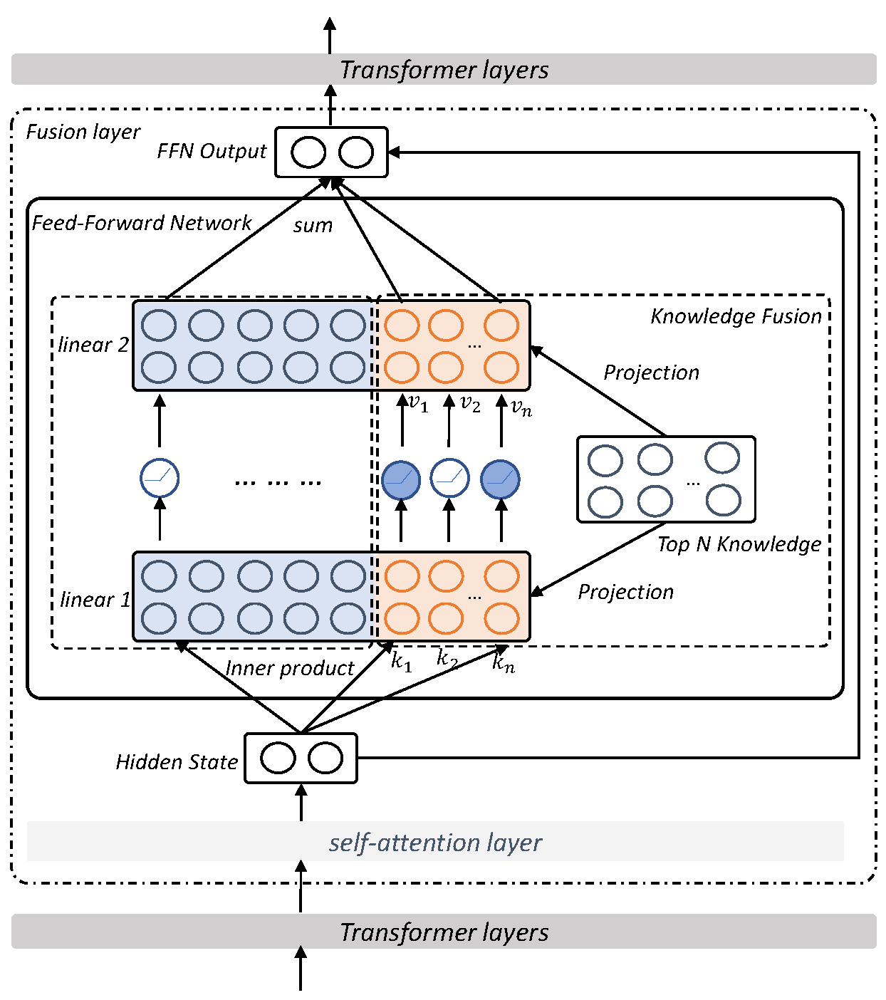

# Kformer

Code for our NLPCC 2022 paper ***[Kformer: Knowlede Injection in Transformer Feed-Forward Layers](https://arxiv.org/pdf/2201.05742.pdf)***

The project is based on [Fairseq](https://github.com/pytorch/fairseq).


<div align=center></div>

## Requirements
To install requirements:

```
cd fairseq
./setup.sh
```

## Download Model
```
mkdir models
cd models
wget https://dl.fbaipublicfiles.com/fairseq/models/roberta.base.tar.gz
tar -zxvf roberta.base.tar.gz
```

## Data
You can download the data from [ZJU Cloud](https://pan.zju.edu.cn/share/486968b763a8bd334360556dc0) and put it under the `.\data\`.
The data we provide here is the question with the retrieved knowledge using bm25.
## Run the experiments

### Finetuning

#### Social IQA

Use the command below to finetune SocialIQA on Kformer. You can change the layer to inject by editing the arg `--knowledge_layer`.
 `--knowledge_layer` contains two arguments [a,b) denoting the interval of the layer of Roberta. You need to change [this line](https://github.com/zjunlp/Kformer/blob/main/fairseq/fairseq/modules/transformer_sentence_encoder.py#L263) to change the number of the knowledge used for infusion.

```shell
./fairseq/run_social.sh
```

 #### MedQA

Use the command below to finetune MedQA on Kformer.

```shell
./fairseq/run_med.sh
```

### Evaluation
Use the following command to evalute the finetuned model. Set the `--knowledge_layer` the same as the arg during finetuning.

```
export ModelPath = $ModelPath$
export DataPath = $DataPath$
python fairseq/test_social.py --model_path $ModelPath$ --knowledge_layer 9 12 --data_file $DataPath$
```

Change fairseq/test_social.py to test_med.py to evaluate MedQA.


## If you find this repo helpful...
Please give us a :star: and cite our paper as
```bibtex
@article{Yao2022KformerKI,
  title={Kformer: Knowledge Injection in Transformer Feed-Forward Layers},
  author={Yunzhi Yao and Shaohan Huang and Li Dong and Furu Wei and Huajun Chen and Ningyu Zhang},
  journal={ArXiv},
  year={2022},
  volume={abs/2201.05742}
}
```
